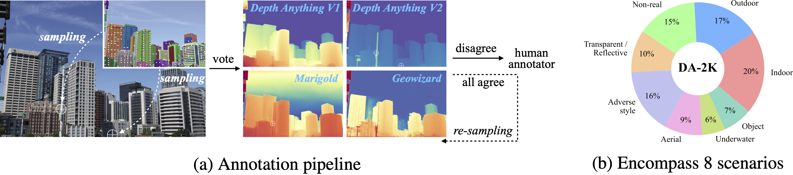

# DA-2K Evaluation Benchmark

## Introduction



DA-2K is proposed in [Depth Anything V2](https://depth-anything-v2.github.io) to evaluate the relative depth estimation capability. It encompasses eight representative scenarios of `indoor`, `outdoor`, `non_real`, `transparent_reflective`, `adverse_style`, `aerial`, `underwater`, and `object`. It consists of 1K diverse high-quality images and 2K precise pair-wise relative depth annotations.

Please refer to our [paper](https://arxiv.org/abs/2406.09414) for details in constructing this benchmark.


## Usage

Please first [download the benchmark](https://huggingface.co/datasets/depth-anything/DA-2K/tree/main).

All annotations are stored in `annotations.json`. The annotation file is a JSON object where each key is the path to an image file, and the value is a list of annotations associated with that image. Each annotation describes two points and identifies which point is closer to the camera. The structure is detailed below:

```
{
  "image_path": [
    {
      "point1": [h1, w1], # (vertical position, horizontal position)
      "point2": [h2, w2], # (vertical position, horizontal position)
      "closer_point": "point1" # we always set "point1" as the closer one
    },
    ...
  ],
  ...
}
```

To visualize the annotations:
```bash
python visualize.py [--scene-type <type>]
```

**Options**
- `--scene-type <type>` (optional): Specify the scene type (`indoor`, `outdoor`, `non_real`, `transparent_reflective`, `adverse_style`, `aerial`, `underwater`, and `object`). Skip this argument or set <type> as `""` to include all scene types.

## Citation

If you find this benchmark useful, please consider citing:

```bibtex
@article{depth_anything_v2,
  title={Depth Anything V2},
  author={Yang, Lihe and Kang, Bingyi and Huang, Zilong and Zhao, Zhen and Xu, Xiaogang and Feng, Jiashi and Zhao, Hengshuang},
  journal={arXiv:2406.09414},
  year={2024}
}
```