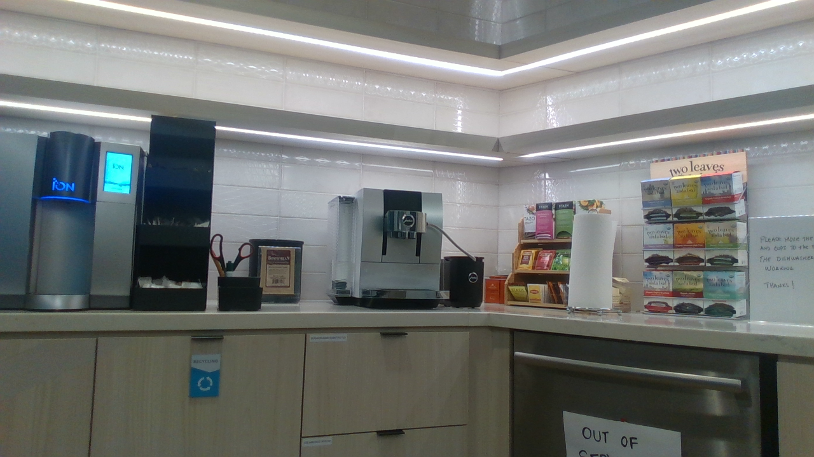
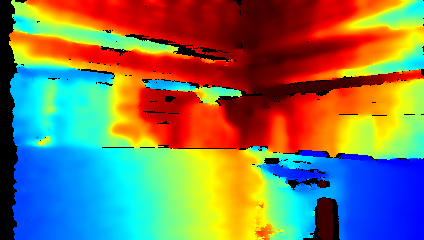
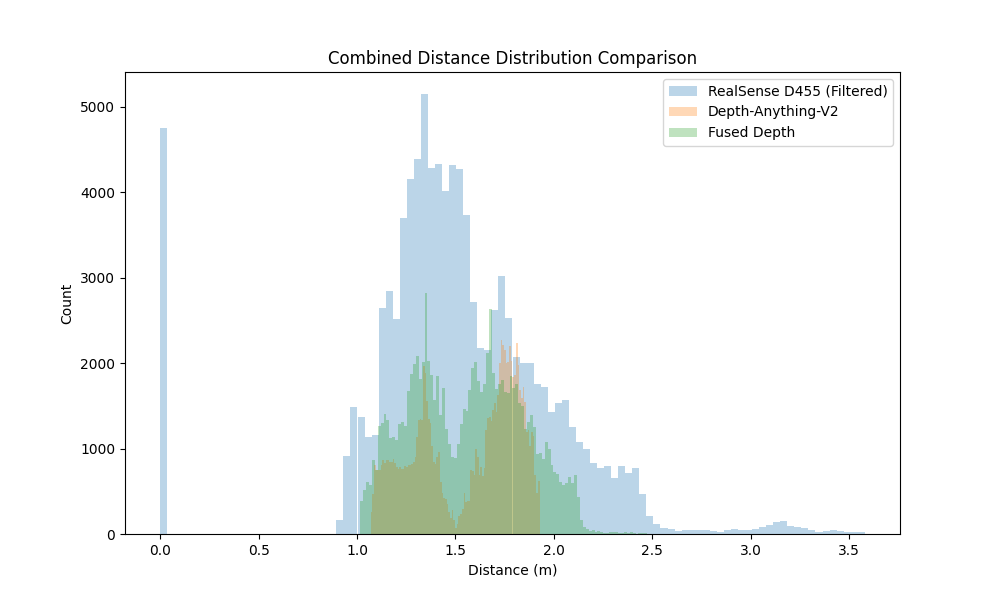

# Depth Fusion with Depth-Anything-V2

This repository implements an advanced depth fusion system that combines depth measurements from Intel RealSense D455 camera with monocular depth predictions from Depth-Anything-V2. The fusion approach leverages confidence weighting and edge preservation to create high-quality depth maps.

## Features

- RealSense D455 depth data parsing and visualization
- Depth-Anything-V2 monocular depth prediction
- Advanced depth fusion with confidence weighting
- Edge-aware fusion for better depth discontinuities
- Comprehensive evaluation metrics (MAE, SSIM)
- Point cloud visualization support

## Evaluation Metrics

The system uses two main metrics to evaluate the quality of depth fusion:

### MAE (Mean Absolute Error)
- Measures the average absolute difference between predicted and ground truth depth values
- Lower values indicate better fusion quality
- 平均绝对误差：测量预测深度值与真实深度值之间的平均绝对差异，值越小表示融合效果越好

### SSIM (Structural Similarity Index Measure)
- Evaluates how well the fused depth map preserves structural details
- Considers structural information, luminance, and contrast
- Values range from 0 to 1, with 1 indicating perfect structural similarity
- 结构相似性指数：评估融合深度图保留结构细节的程度，考虑了结构信息、亮度和对比度，值越接近1表示结构相似性越好

## Requirements

- Python 3.x
- PyTorch
- OpenCV
- NumPy
- Matplotlib
- Open3D (for point cloud visualization)
- scikit-image
- Intel RealSense D455 camera (for raw depth data)

## Usage

### 1. Depth Prediction with Depth-Anything-V2

```bash
python run.py --encoder vitb --img-path assets/examples/realsense_Color.png --outdir depth_vis
```

### 2. Depth Fusion

The fusion process combines RealSense D455 depth data with Depth-Anything-V2 predictions:

```bash
python fuse_depth.py
```

This will:
- Parse RealSense D455 depth data
- Generate Depth-Anything-V2 predictions
- Perform confidence-weighted fusion
- Save visualization as 'fused_depth_advanced.png'

### 3. Point Cloud Generation

```bash
python metric_depth/depth_to_pointcloud.py --encoder vits --load-from checkpoints/depth_anything_v2_vits.pth --img-path assets/examples/realsense_Color.png --outdir pointcloud_vis --focal-length-x 216.249817 --focal-length-y 216.249817
```

### 4. View Point Cloud

To visualize the generated point cloud:

```bash
python view_ply.py <path_to_ply_file>
```

### 5. Point Cloud Comparison

To generate and compare point clouds from different depth sources:

```bash
python compare_pointclouds.py
```

This will:
- Generate point clouds from RealSense D455, Depth-Anything-V2, and fused depth
- Create distance distribution histograms
- Save point clouds as PLY files in the `pointcloud_comparison` directory
- Save histograms as PNG files

Example input data:
- RGB Image: `assets/examples/DC-510/kitchen/kitchen_5_Color.png`

- Depth Image: `assets/examples/DC-510/kitchen/kitchen_5_Depth.png`


The comparison results can be viewed in:
- `pointcloud_comparison/combined_histogram.png`: Combined distance distribution comparison


To view individual point clouds:
```bash
python view_ply.py pointcloud_comparison/realsense.ply  # RealSense D455 (Filtered)
python view_ply.py pointcloud_comparison/depth_anything.ply  # Depth-Anything-V2
python view_ply.py pointcloud_comparison/fused.ply  # Fused Depth
```

For detailed comparison results and visualizations, see the [Point Cloud Comparison Results](https://docs.google.com/presentation/d/1BSeugKh_94BREHsL3uTXQn6r7ntAcwKrA2Rmn_I-nS8/edit?usp=sharing).

## Input Data Format

The system expects the following input files:
- `realsense_Color.png`: RGB image from RealSense camera
- `realsense_Depth.raw`: Raw depth data from RealSense camera
- `realsense_Depth_metadata.csv`: Metadata file containing depth sensor parameters

## Output

The fusion process generates:
- Fused depth map visualization
- Evaluation metrics (MAE and SSIM)
- Point cloud visualization (optional)

## Model Options

Depth-Anything-V2 supports multiple encoder variants:
- `vits`: Small ViT encoder
- `vitb`: Base ViT encoder
- `vitl`: Large ViT encoder
- `vitg`: Giant ViT encoder